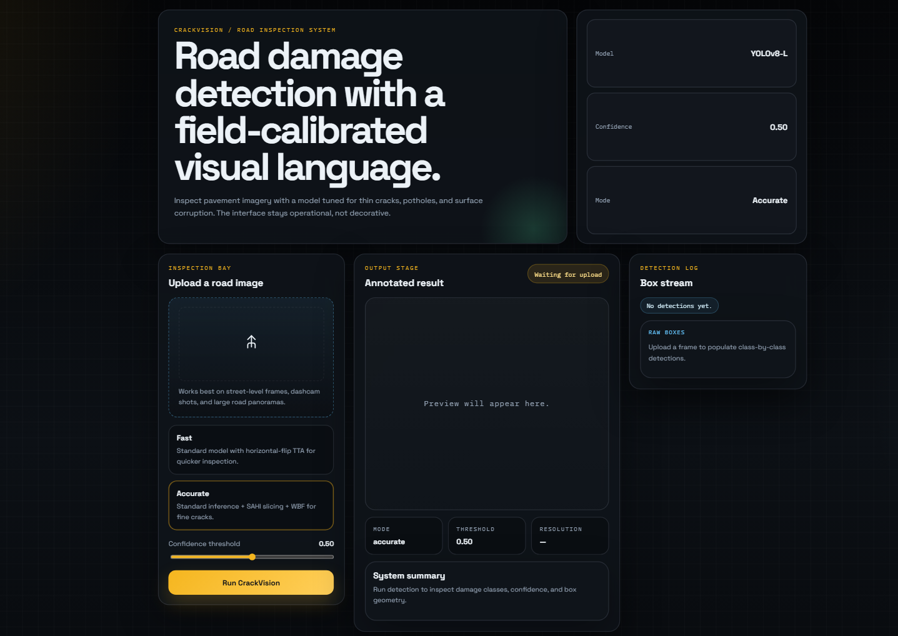
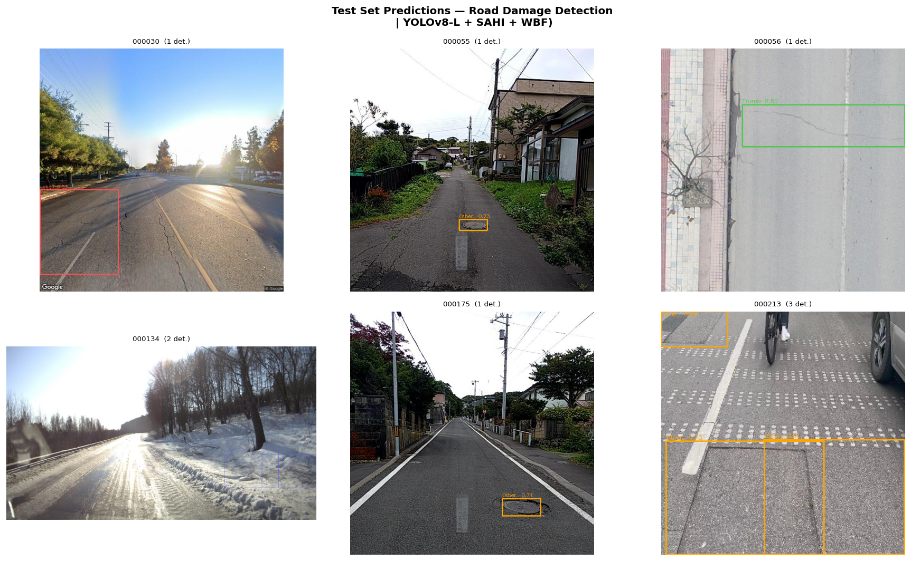
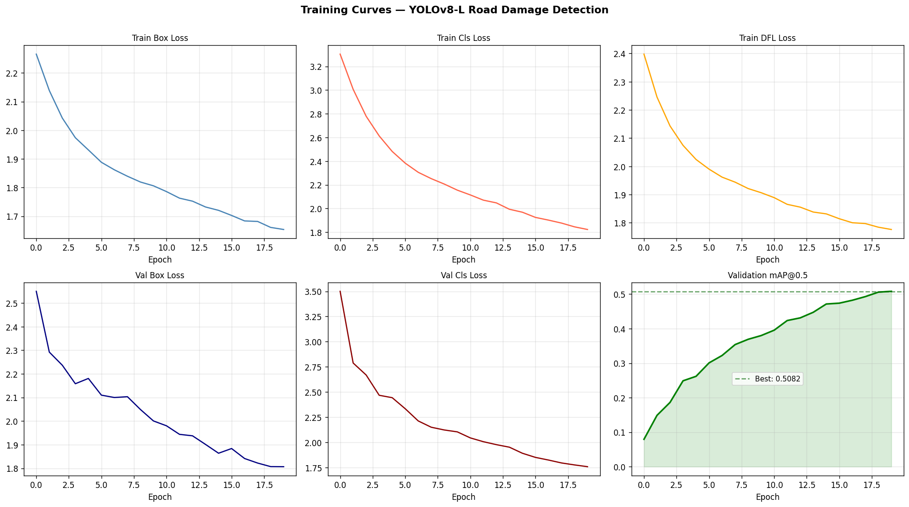

# CrackVision
### Slicing-Enhanced Pavement Damage Detection using YOLOv8

[](https://alphacalculus-crackvision.hf.space)
[](https://crackvision.vercel.app/)
---

# Overview

CrackVision is a deep learning-powered road damage detection system designed for identifying and localizing pavement defects from real-world road imagery.

The project combines a fine-tuned **YOLOv8-L** object detector with advanced inference strategies such as:

- SAHI sliced inference
- Horizontal flip Test-Time Augmentation (TTA)
- Weighted Box Fusion (WBF)

to improve the detection of thin and small-scale pavement cracks that are often missed by standard object detection pipelines.

The system supports:
- Image upload
- Interactive web-based inference
- Real-time visualization
- Dual inference modes (Fast / Accurate)
- Hugging Face deployment
- Next.js frontend integration

---

# Live Demo

### Hugging Face Backend
🚀 https://alphacalculus-crackvision.hf.space

### Web Frontend
🌐 https://crackvision.vercel.app/

### User Interface



The web interface provides an intuitive workflow:
- Upload road damage images
- Select detection mode (Fast or Accurate)
- Adjust confidence threshold
- View annotated results with detection boxes and class labels

---

# Features

## Detection Capabilities
- Longitudinal Crack detection
- Transverse Crack detection
- Alligator Crack detection
- Other Road Corruption detection
- Pothole detection

### Example Predictions



The model successfully detects various types of pavement damage across diverse road conditions, lighting, and perspectives.

## Inference Modes

### Fast Mode
- Standard YOLOv8-L inference
- Horizontal-flip TTA
- Optimized for speed and responsiveness

### Accurate Mode
- SAHI sliced inference
- Weighted Box Fusion
- Better small-crack detection
- Optimized for precision

---

# Model Performance

| Metric | Value |
|---|---|
| Validation mAP@0.5 | 0.5082 |
| Validation mAP@0.5:0.95 | 0.2390 |
| Training Epochs | 20 |
| Inference Backend | YOLOv8-L |
| Hardware | Tesla T4 GPU |

### Training Curves



All losses decreased smoothly over 20 epochs with validation mAP@0.5 reaching 0.5082, indicating the model would benefit from additional training.

---

# System Architecture

```text
Road Image
    │
    ├──► Fast Mode
    │       └── YOLOv8-L + TTA
    │
    └──► Accurate Mode
            ├── SAHI Sliced Inference
            ├── Tile-wise Detection
            ├── Weighted Box Fusion
            └── Final Predictions
````

---

# Tech Stack

## Machine Learning

* YOLOv8-L
* PyTorch
* SAHI
* Weighted Box Fusion
* OpenCV

## Backend

* FastAPI
* Python

## Frontend

* Next.js
* React
* Tailwind CSS

## Deployment

* Hugging Face Spaces
* Docker
* Vercel

---

# Repository Structure

```text
CrackVision/
├── app/                                 # Next.js frontend
│   ├── page.jsx
│   ├── layout.jsx
│   ├── globals.css
│   └── api/predict/route.js
│
├── app.py                               # FastAPI backend
├── crackvision_service.py               # Inference engine
├── requirements.txt
├── package.json
├── next.config.js
├── Dockerfile
│
├── RoadDamage/
│   ├── yolov8l_road_damage/
│   │   └── weights/best.pt
│   └── opt_conf.json
│
└── README.md
```

---

# API Endpoints

## POST `/predict`

Runs inference on uploaded image.

### Parameters

| Parameter  | Type   | Description         |
| ---------- | ------ | ------------------- |
| image      | file   | Input image         |
| mode       | string | fast / accurate     |
| confidence | float  | Detection threshold |

---

# Local Development

## Clone Repository

```bash
git clone https://github.com/Ayush-Raj-Chourasia/CrackVision
cd CrackVision
```

---

# Backend Setup

## Install Dependencies

```bash
pip install -r requirements.txt
```

## Run Backend

```bash
uvicorn app:app --host 0.0.0.0 --port 7860
```

Backend:

```text
http://localhost:7860
```

---

# Frontend Setup

## Install Node Modules

```bash
npm install
```

## Configure Backend URL

Create:

```text
.env.local
```

Add:

```env
CRACKVISION_API_URL=http://localhost:7860
```

## Start Frontend

```bash
npm run dev
```

Frontend:

```text
http://localhost:3000
```

---

# Hugging Face Deployment

## Backend Deployment

1. Create a new Hugging Face Space
2. Select:

   * SDK: Docker
3. Upload:

   * `app.py`
   * `requirements.txt`
   * `Dockerfile`
   * `best.pt`
4. Hugging Face automatically builds and deploys the backend

---

# Vercel Deployment

1. Import repository into Vercel
2. Add environment variable:

```env
CRACKVISION_API_URL=https://your-space-url.hf.space
```

3. Deploy frontend

---

# Inference Pipeline

## Fast Mode

```text
Input Image
    ↓
YOLOv8-L
    ↓
Horizontal Flip TTA
    ↓
Final Detection
```

---

## Accurate Mode

```text
Input Image
    ↓
SAHI Image Slicing
    ↓
YOLOv8-L Detection Per Tile
    ↓
Weighted Box Fusion
    ↓
Final Detection
```

---

# Why SAHI?

High-resolution road images contain very small crack structures.

When resized directly to 640×640:

* thin cracks disappear
* fine details are lost

SAHI preserves these structures by:

* slicing images into overlapping tiles
* running inference per tile
* merging detections afterward

This significantly improves small-object detection quality.

---

# Future Improvements

* Real-time video inference
* Webcam mode
* ONNX / TensorRT optimization
* Mobile deployment
* Damage severity estimation
* GPS-based road inspection integration

---

